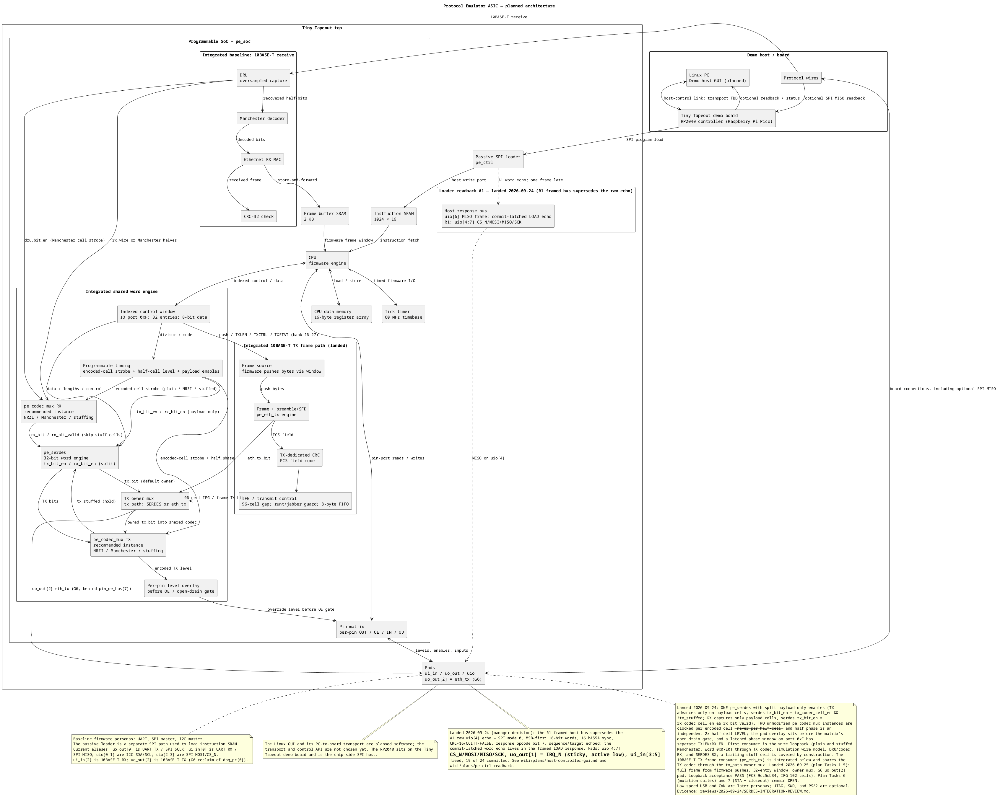
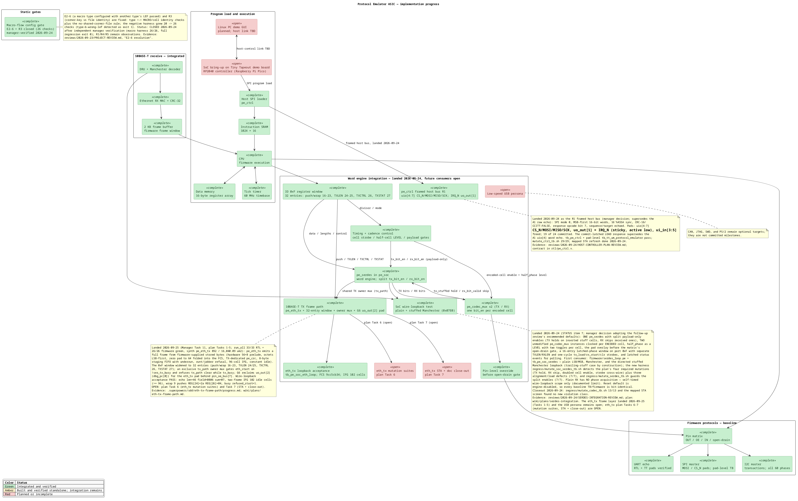

# Protocol Emulator ASIC — Jane Street competition entry

Entry for [Jane Street's protocol emulator ASIC competition](https://blog.janestreet.com/protocol-emulator-asic-competition/):
design an open-source, general-purpose protocol emulator — a small chip whose
instruction set reads and writes pins, counts cycles and hits protocol timing
precisely, so most protocol sequencing can live in **firmware** rather than
dedicated protocol logic. Target: IHP 130 nm CMOS5L via Tiny Tapeout, 6×4 tiles,
submission 2027-01-18.

**Status: the programmable core runs UART, SPI mode 0, and a complete I2C
write/read transaction as firmware on real RTL. The wrapper also has a passive
SPI program loader, and the SoC integrates the 10BASE-T receive path plus the
TX frame path (the chip exchanges a real frame with itself over the wire
loopback). See
[`wiki/STATUS.md`](wiki/STATUS.md) for integration details and the ordered work
list.**

> Picking this up cold (human or agent)? Read **[`HANDOFF.md`](HANDOFF.md)** first
> — current verified state, the traps worth not rediscovering, and the next step.

## Block diagrams

**Project plan** — architecture and contracts
([SVG](diagrams/project-plan.svg) · [PlantUML](diagrams/project-plan.puml)):



**Implementation progress** — per-block status
([SVG](diagrams/project-progress.svg) · [PlantUML](diagrams/project-progress.puml)):



## What exists today

Mapped cell areas below are standard cells at sg13g2 typical, before placement;
SRAM macro footprints are excluded.

| Block | File | Size (mapped, sg13g2 typ) |
|---|---|---|
| SERDES — 1–32 b word engine, runtime bit order, strobe-paced | `rtl/pe_serdes.v` | 539 cells / 11.2k µm² (17.2k µm² routed) |
| NRZI / Manchester / bit-stuffing codecs | `rtl/pe_nrzi.v`, `rtl/pe_manch.v`, `rtl/pe_bitstuff.v` | 15 / 7 / 99 cells |
| Config-driven codec pipeline mux | `rtl/pe_codec_mux.v` | 130 cells / 1.8k µm² |
| **CRC / LFSR engine** — CRC-5/8/15/16/32, one datapath | `rtl/pe_crc.v` | 209 cells / 3.4k µm² |
| **DRU** — oversampled Manchester receive (10BASE-T, PS/2), dual-edge | `rtl/pe_dru.v` | 148 cells / 2.4k µm² |
| CPU — 16-bit insn, 16 opcodes, A/Y/X, PC width from IMEM depth | `rtl/pe_cpu.v` | 377 cells / 4.8k µm² |
| Passive SPI program loader — mode 0, MSB-first, IMEM only | `rtl/pe_ctrl.v` | 292 cells / 5.8k µm² |
| **Instruction memory** — real SRAM macro + protocol wrapper | `rtl/pe_imem.v` | 12 glue cells (+ the macro's LEF area) |
| Ethernet receive MAC — DRU/Manchester/CRC integration and frame window | `rtl/pe_eth_mac.v` | 1,402 cells / 20.4k µm² |
| **Frame buffer** — 2 KB SRAM macro + wrapper | `rtl/pe_fbuf.v` | 48 glue cells (+ the macro's LEF area) |
| Programmable protocol SoC — CPU + IMEM + ticks + pin matrix + Ethernet RX | `rtl/pe_soc.v` | 3,298 cells / 53.7k µm² |
| **Tiny Tapeout top level** — loader + SoC, the deliverable | `rtl/tt_um_protocol_emulator.v` | 3,613 cells / 59.5k µm² |
| Assembler / bit-accurate emulator | `tools/fw/peasm.py`, `tools/fw/peemu.py` | Python |
| The UART itself — **as firmware** | `firmware/uart_echo.pe` | 114 words |

Verified by **29 self-checking testbenches + 20 firmware tests + a lint gate**
(`regress/run_all.sh`), including one TB per target protocol: UART, SPI, I2C,
JTAG, SWD, PS/2, CAN, USB-LS, 10BASE-T. Seven mutation suites and generated-doc
gates also pass. **The operating point and signoff target are
60 MHz** (`CLOCK_PERIOD` 16.667 ns in both flow configs). The SERDES's historical
2026-09-18 place-and-route run reported 0 DRC, 0 LVS and +7.6 ns setup slack at
the slow corner under the former 66 MHz constraint. The current configs use the
60 MHz target; recorded timing results are in [`wiki/STATUS.md`](wiki/STATUS.md).

`regress/lint.sh` runs Verilator `-Wall` plus a yosys elaboration check on every top,
and the regression fails if either finds anything. It exists because a green
testbench says nothing about the netlist: two drivers on one flop raced in Icarus
and became a constant 0 in yosys, and a hierarchical debug reference simulated
correctly while synthesising backwards. Neither is reachable from a testbench.

`tb/tb_pe_soc_uart.v` demonstrates the UART firmware on `pe_soc`: one input
pin, one output pin, a counter, and a program produce 115200 8N1, echoing bytes
at 8.6–8.7 µs per bit cell measured at the pin. The same core and pin matrix
run SPI mode 0 and a complete I2C write/repeated-START/read transaction. The
I2C transaction is checked against independent emulator and RTL slave models;
it also handles arbitration loss (release both lines, no STOP), unexpected
NACKs (record the phase, issue a STOP and abort) and SCL stretching (poll the
pad before timing tHIGH). An abort parks with an outcome code — there is no
STOP-qualified bus-free wait and no retry.

The instruction memory is a **real SRAM macro** (`1P_1024x16`, 1,024 program
words) behind `rtl/pe_imem.v`; `pe_ctrl` loads it through the wrapper's SPI pads
before `run` rises. The intended board-side controller is the RP2040 on the
Tiny Tapeout demo board (Raspberry Pi Pico); it drives this passive SPI loader.
A Linux PC demo GUI is on the TODO list; its PC-to-board transport and control
API have not been selected.
The pin matrix (`rtl/pe_pinmux.v`) supplies per-pin
direction and open-drain control. The 2 KB frame buffer and 10BASE-T receive
chain are integrated into `pe_soc`; `firmware/eth_rx.pe` consumes the verified
frame window. See [`wiki/STATUS.md`](wiki/STATUS.md) for limits and next steps.
The word FIFO remains future work.

## Quick start

```bash
./regress/run_all.sh             # firmware regression, all 29 TBs, lint, doc drift
./regress/run_firmware_tests.sh  # just assemble + emulate the firmware
./regress/lint.sh                # verilator -Wall + yosys elaboration check
./regress/synth_area.sh          # mapped cell count + area per block (needs yosys + IHP PDK)

# the fast firmware loop: 2 seconds instead of a 1-minute RTL build
python3 tools/fw/peasm.py firmware/uart_echo.pe -o firmware/uart_echo.hex
python3 tools/fw/peemu.py firmware/uart_echo.hex --send "41 42" --max-cycles 900000
```

Place-and-route uses dockerized LibreLane and the checked-in **60 MHz**
constraints (`CLOCK_PERIOD` 16.667 ns; see `wiki/concepts/pdk-toolchain.md`):

```bash
flow/run_librelane.sh flow/pe_serdes.json   # results under ~/asic-runs/
```

## Layout

```
rtl/        synthesizable Verilog (the hardware): one module per file --
            pe_serdes, pe_nrzi, pe_manch, pe_bitstuff, pe_codec_mux, pe_crc,
            pe_dru, pe_cpu, pe_imem, pe_fbuf, pe_eth_mac, pe_ctrl, pe_pinmux,
            pe_soc, and tt_um_protocol_emulator (the Tiny Tapeout top level --
            the only submittable module); rtl/vendor/ holds the SRAM macro's
            port shell
info.yaml   Tiny Tapeout project metadata: tiles, clock, pinout
flow/       LibreLane config + runner (pe_soc.*, pe_serdes.*), reproducible from
            a clone
tb/         self-checking testbenches only (tb_*.v)
regress/    the regression itself: run_all.sh, run_one_tb.sh,
            run_firmware_tests.sh, lint.sh, synth_area.sh, param_guards.sh,
            sram_model.sh, and the seven mutate_*_tb.sh harnesses
firmware/   protocol programs (.pe source, .hex assembled) -- uart_echo is the UART
tools/fw/   peasm.py (assembler), peemu.py (bit-accurate emulator)
tools/gen/  documentation generators (block inventory, clock arithmetic, CRC
            config, floorplan feasibility, pin budget, signal glossary, SRAM
            budget), drift-checked in the regression
tools/checks/  standalone validation helpers
reviews/    the external review passes and their evidence (historical; the probe
            scripts are kept runnable)
diagrams/   editable PlantUML text: project plan and implementation progress
sim/        VCD waveforms from the testbenches (regenerated, not tracked)
wiki/       the design record -- read STATUS.md; its Next-steps section is the work list
```

The `wiki/` is where the reasoning lives: competition rules and platform
constraints, protocol physical-layer analysis, timing plans and their arithmetic,
ADRs, the current work plan, and the toolchain notes (including the failure modes
worth not rediscovering). `wiki/STATUS.md` is the resume-here page, and its
Next-steps section is the live work list (`plans/through-i2c` is a completed plan,
kept for its findings).

## Design in one paragraph

Most protocol sequencing runs in **firmware**. The 377-cell CPU executes
programs against the pin matrix and cycle counter; the UART is 114 words of
firmware, SPI mode 0 and a fixed I2C transaction run there too. The wrapper's
`pe_ctrl` SPI slave loads instruction SRAM before `run`; 10BASE-T receive uses
a dedicated SoC datapath and frame buffer. For protocols where a byte moves in
one operation (UART/SPI/CAN/USB), the shared SERDES handles the datapath: a
programmable divider generates a `bit_en` strobe per bit cell, the SERDES
converts words to and from bit streams, and the codec pipeline applies line
coding. A 60 MHz board clock (DDR capture) makes every hard protocol's timing an
exact integer number of ticks; 10BASE-T's 50 ns half-bit cell is the binding
constraint at 3 ticks. Signoff targets the same **60 MHz** operating point
(16.667 ns); the former 66 MHz signoff target is retired. No PLL, no DLL. I2C
uses firmware bit-banging because its control flow is per bit; see
`wiki/plans/through-i2c.md`.
