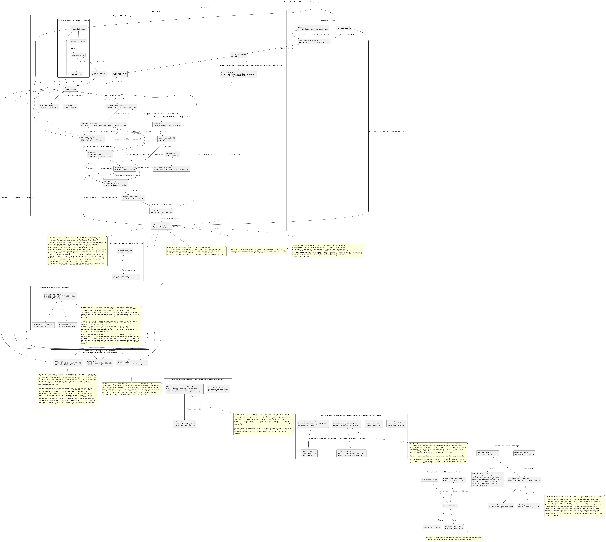
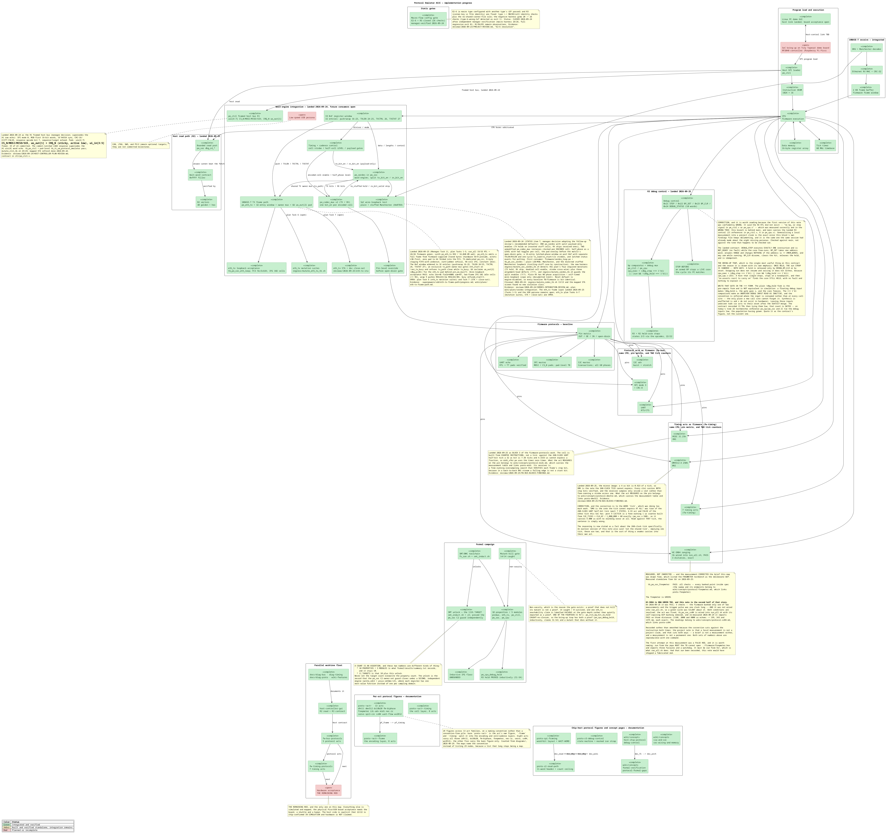
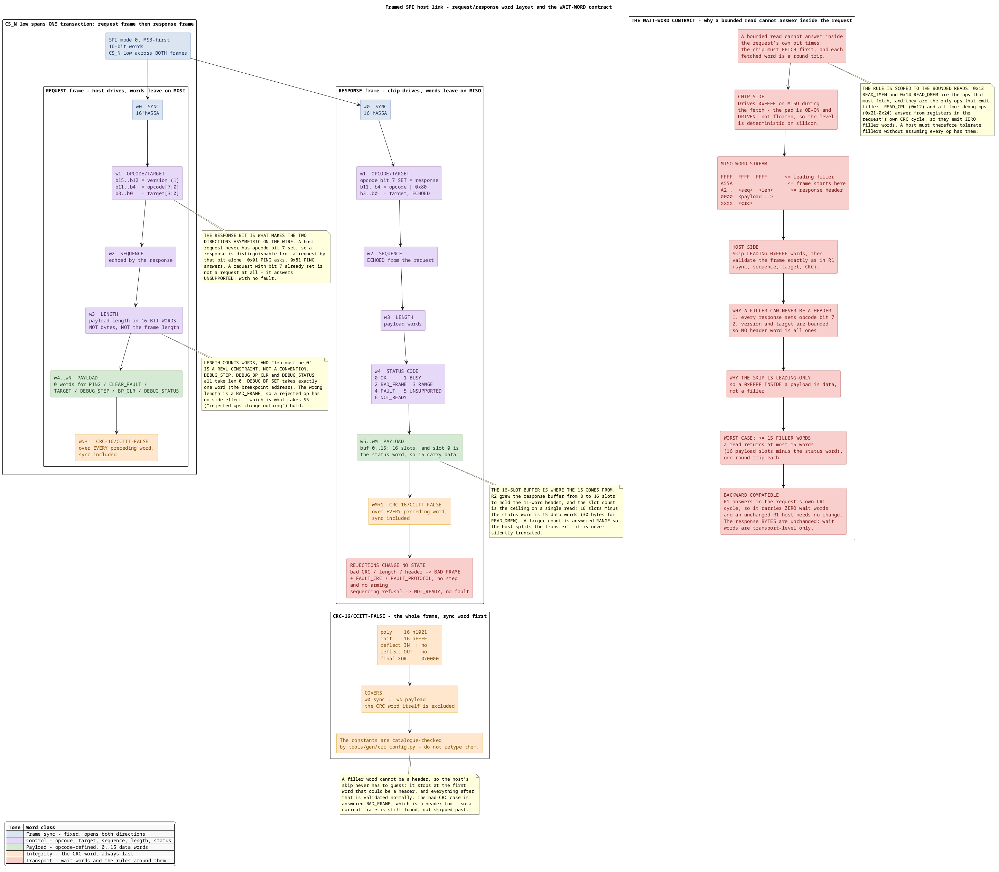
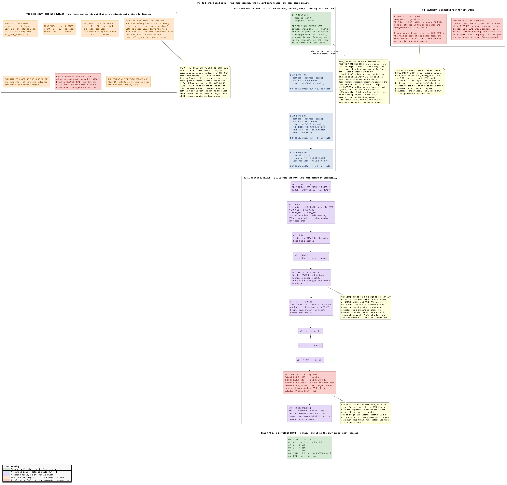
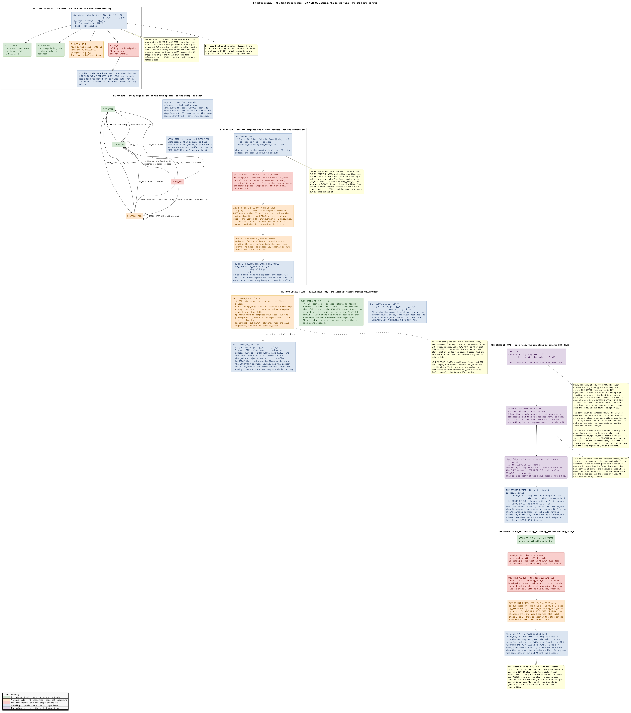

# Protocol Emulator ASIC — Jane Street competition entry

Entry for [Jane Street's protocol emulator ASIC competition](https://blog.janestreet.com/protocol-emulator-asic-competition/):
a small chip whose instruction set reads and writes pins, counts cycles and hits
protocol timing exactly, so most protocol sequencing lives in **firmware** rather
than dedicated protocol logic. One CPU, a shared SERDES and line-codec pipeline,
a pin matrix and a 10BASE-T datapath speak UART, SPI, I2C, JTAG, SWD, PS/2, CAN,
USB-LS and 10BASE-T — by loading a different program. Target: IHP 130 nm CMOS5L
via [Tiny Tapeout](https://tinytapeout.com/), 6×4 tiles; competition deadline
**2027-01-18**, March 2027 CMOS5L shuttle (foundry schedule permitting).

**Status — 2026-10-06. Everything green below is a simulation result; the design
has never been submitted to a shuttle, and no silicon has been measured.** The
programmable core runs UART, SPI mode 0 and a complete I2C
write/repeated-START/read transaction as firmware on real RTL. The SoC integrates
10BASE-T **receive and transmit** (real Manchester on the pad, both directions
proven by testbench) and a framed host bus: R1 (PING / LOAD / STATUS /
CLEAR_FAULT / TARGET, sticky faults, `IRQ_N`, target-1 loopback), R2 reads
(`READ_CPU` / `READ_IMEM` / `READ_DMEM` / `DUMP_CORE`, an 11-word core header and
a wait-word contract) and R3 debug control (single-instruction step, one PC
breakpoint, `DEBUG_STATUS` readback). A laptop loads, runs, observes and debugs
the chip over USB through the [host controller](#host-controller-usb--pico--pe)
below.

The full gate is green at `994224c` (2026-10-06): **48/48 firmware tests, 51/51
testbench runs, 17 mutation suites with no unexplained survivors**, formal safety
proofs plus their non-vacuity mutants, the lint gate, and the documentation gates
(wiki links 0 dead across 80 documents; 69 diagram checks; document index 54/54). The
v1.0 baseline is recorded in
[`reviews/2026-09-28/V1.0-GATE.log`](reviews/2026-09-28/V1.0-GATE.log). **The one
open item is the real-board acceptance run** — a Pico on the Tiny Tapeout demo
board over USB — and it is hardware-gated, not design-gated. The live state and
the ordered work list are in [`wiki/STATUS.md`](wiki/STATUS.md); the judge-facing
demo script (four acts, proven vs pending, plus a no-board fallback) is
[`docs/demo-walkthrough.md`](docs/demo-walkthrough.md).

> Picking this up cold (human or agent)? Read **[`HANDOFF.md`](HANDOFF.md)** first
> — current verified state, the traps worth not rediscovering, and the next step.

## Verify it yourself

A few minutes, no board:

| Command | What it shows |
|---|---|
| `./regress/run_firmware_tests.sh` | assemble + emulate every firmware program — **FIRMWARE: 48 PASS: 48 FAIL: 0** (~12 s) |
| `python3 tools/fw/peasm.py firmware/uart_echo.pe -o firmware/uart_echo.hex && python3 tools/fw/peemu.py firmware/uart_echo.hex --send "41 42"` | the UART persona end to end, bit-accurately, in about a second — no RTL build |
| `python3 tools/host_bridge/acceptance.py --fake` | the whole host path (session → bridge protocol → fake PE) with no hardware |
| `tools/host_gui/run_host_tests.sh` | the host gate: unit tests, bridge tests, lint, protocol/server fuzz, soak smoke, acceptance |
| `bash regress/lint.sh` | `verilator -Wall` + a yosys elaboration check on every top (needs verilator + yosys) |

The chip-side full regression is one command. It includes the mutation suites, so
it is a 20–30 minute named gate, not a keystroke check:

```bash
regress/tier.sh 2                  # the full gate; refuses to start unless the tree is clear
./regress/run_all.sh --fast -j8    # the same gate directly (--fast is parallel iverilog, not a simulator swap)
./regress/synth_area.sh            # mapped cells + area per block (needs yosys + the IHP PDK liberty)
```

Place-and-route is dockerized LibreLane against the checked-in **60 MHz**
constraints (`CLOCK_PERIOD` 16.667 ns; see
[`wiki/concepts/pdk-toolchain.md`](wiki/concepts/pdk-toolchain.md)):

```bash
flow/run_librelane.sh flow/pe_serdes.json   # results under ~/asic-runs/
flow/run_librelane.sh flow/pe_soc.json
```

Requirements: `iverilog` ≥ 11 and `python3` for the regression; `verilator` +
`yosys` + the IHP PDK for lint and area; docker for place-and-route; `plantuml`
for the diagram gate.

<!-- BEGIN gui-worker host block (host controller section) - keep whole;
     place BESIDE the chip-side Quick start / Layout sections when merging -->
## Host controller (USB → Pico → PE)

The operator tooling lives in `tools/host_gui/` (browser UI, session state
machine, framed protocol) and `tools/host_bridge/` (MicroPython bridge for the
TT demo board). Contract and decisions: `wiki/plans/host-controller-gui.md`.

```bash
pip install .[host-gui]           # optional: fastapi/uvicorn + pyserial
sudo usermod -aG dialout $USER    # then re-login: the CDC device is root:dialout

tools/host_gui/run_host_tests.sh   # the one-command host gate (tests + lint + fuzz + soak + acceptance)
python3 tools/host_bridge/acceptance.py --fake
python3 tools/host_bridge/acceptance.py --device /dev/ttyACM0 --board <rev>
```

Deploy the bridge by copying `tools/host_bridge/{main,pe_frame,tt_adapter}.py`
to the Pico's MicroPython filesystem and running `main.py`: it selects the
shuttle, starts the 60 MHz project clock, holds reset, configures the host SPI
on `uio[4:7]`, and speaks the newline-JSON protocol over USB CDC. The
first-pass SCLK cap is 5 MHz (`min(5 MHz, project_clk/6)`); `LOAD` always
forces `run=0`, and `start` raises `ui_in[1]` only after a successful LOAD
response. The local page is served by `tools.host_gui.server.serve(Api())`
(the acceptance runner is the scripted equivalent of the same sequence).

Evidence levels are kept distinct: **simulator** (fake PE model),
**host-verified** (this tree's tests), **board-observed** (Pico `hello`/STATUS),
and **chip-confirmed** — the R1/R2/R3 host protocol in RTL, verified in
simulation: the R2 golden package is confirmed against the real RTL, and the
`VvpTTAdapter` replays a whole recorded host session against the real chip RTL
under `vvp`. The real device run is still pending hardware. `acceptance.py --fake` is the current end-to-end evidence and its checklist is in
`tools/host_gui/tests/fixtures/acceptance.md`. The R2 read obligations
themselves live in `tools/host_gui/r2_reads.py` — probes over the host FakePE
model, marked **not chip-confirmed**; the chip-side confirmation is the R2
golden package, 22/22 steps byte-exact against the real RTL in simulation, and
still not a board result.

**Docs:** `docs/host-bridge-bringup.md` is the operator runbook (flash, deploy,
permissions, the real acceptance, failure triage). `docs/demo-walkthrough.md`
is the judge-facing demo script (the four protocols, proven vs pending, the
no-board fallback). Both are pinned by tests so their claims cannot go stale.

<!-- END gui-worker host block (host controller section) -->

## What is in the chip today

| Block | File | What it is |
|---|---|---|
| SERDES | `rtl/pe_serdes.v` | 1–32-bit word engine, runtime bit order, paced by a per-bit-cell `bit_en` strobe |
| Line codecs | `rtl/pe_nrzi.v`, `rtl/pe_manch.v`, `rtl/pe_bitstuff.v` | NRZI, Manchester, bit stuffing (CAN/USB style) |
| Codec pipeline mux | `rtl/pe_codec_mux.v` | `cfg`-selected codec subset; two instances in the SoC (TX and RX) |
| CRC / LFSR engine | `rtl/pe_crc.v` | CRC-5/8/15/16/32 from one datapath, checked against the RevEng catalogue |
| DRU | `rtl/pe_dru.v` | oversampled Manchester receiver, dual-edge capture — 10BASE-T and PS/2 |
| CPU | `rtl/pe_cpu.v` | 16-bit instruction, 16 opcodes, A/Y/X; PC width follows the IMEM depth |
| Pin matrix | `rtl/pe_pinmux.v` | per-pin out / output-enable / open-drain / read-back — the I2C gate |
| Instruction memory | `rtl/pe_imem.v` | 1,024×16 real SRAM macro (`RM_IHPSG13_1P_1024x16_c2_bm_bist`) + glue; a flop build is available for comparison |
| Frame buffer | `rtl/pe_fbuf.v` | 2 KB behind a byte interface, the same macro part as the IMEM |
| 10BASE-T receive MAC | `rtl/pe_eth_mac.v` | SFD lock, byte assembly, FCS check, store-and-forward into the frame buffer |
| 10BASE-T transmit engine | `rtl/pe_eth_tx.v` | preamble/SFD, FCS, 64-byte pad, 96-bit-time IFG, and its own CRC instance |
| Host bus + loader + debug | `rtl/pe_ctrl.v` | passive SPI program loader and the framed host bus (R1 / R2 / R3) |
| Programmable protocol SoC | `rtl/pe_soc.v` | CPU + IMEM + tick timers + pin matrix + SERDES/codecs + 10BASE-T RX/TX |
| Tiny Tapeout top level | `rtl/tt_um_protocol_emulator.v` | loader + SoC — **the deliverable, the only submittable module** |
| Assembler / emulator | `tools/fw/peasm.py`, `tools/fw/peemu.py` | assemble `.pe` → `.hex`; bit-accurate emulation on the host |

The protocol personas are firmware: 27 programs in [`firmware/`](firmware/), one
per act — `uart_echo.pe` (the UART itself is 118 words of firmware),
`spi_xfer.pe`, `i2c_pins.pe` and `i2c_xfer.pe`, plus UART RTS/CTS, SPI mode 3 +
CRC, advanced I2C, DMX-512, MIDI, WS2812, servo PWM, DHT11, DS18B20, NEC IR,
FM0/FM1 bi-phase, a frequency/duty meter, HC-SR04 ranging, a stepper ramp, the
10BASE-T RX/TX consumers, and the emulator and CPU test programs. The same core
and pin matrix run all of them; nothing in the RTL knows which protocol is
loaded.

**Area and timing.** Per-block mapped cell counts and areas are regenerated by
`regress/synth_area.sh` and recorded in
[`wiki/reference/block-diagram.md`](wiki/reference/block-diagram.md) and
[`wiki/reference/floorplan-feasibility.md`](wiki/reference/floorplan-feasibility.md)
(standard cells, sg13g2 typical, pre-placement; the two SRAM macros contribute
area from their LEF — 79,674 µm² each, 237×336 µm — not from gates). The die is
the 6×4 template, 1002×432 µm ≈ 0.433 mm², which `flow/pe_soc.json` declares as
`DIE_AREA`. The operating point is **60 MHz** (16.667 ns) in `info.yaml` and in
both flow configs; the full-SoC LibreLane run signed off setup and hold at all
three corners on 2026-09-22 with **+2.6601 ns** worst setup slack (slow corner)
and 0 violating paths, and the post-route critical path puts Fmax at 71.4 MHz.
`wiki/STATUS.md` records what is *not* clean in that run too: SRAM-pin max-slew /
max-cap checker violations that a longer clock period cannot fix, and a
LibreLane stop before GDS streamout (a PDK-macro-vs-flow `prBoundary` mismatch,
not a design defect).

`regress/lint.sh` runs Verilator `-Wall` plus a yosys elaboration check on every
top, and the regression fails if either finds anything. It exists because a green
testbench says nothing about the netlist: two drivers on one flop raced in Icarus
and became a constant 0 in yosys, and a hierarchical debug reference simulated
correctly while synthesising backwards. Neither is reachable from a testbench.

## Design in one paragraph

Most protocol sequencing runs in **firmware**. The CPU executes programs against
the pin matrix and cycle counter; the UART is 118 words of firmware, and SPI mode
0 and a complete I2C transaction run there too. The wrapper's `pe_ctrl` SPI slave
loads instruction SRAM before `run`; 10BASE-T receive and transmit use dedicated
SoC datapaths, a 2 KB frame buffer for RX and an 8-byte staging FIFO for TX (a
general word FIFO remains future work). For protocols where a word moves in one
operation (UART/SPI/CAN/USB), the shared SERDES handles the datapath: a
programmable divider generates a `bit_en` strobe per bit cell, the SERDES
converts words to and from bit streams, and the codec pipeline applies line
coding. A 60 MHz board clock (DDR capture) makes every hard
protocol's timing an exact integer number of ticks; 10BASE-T's 50 ns half-bit
cell is the binding constraint at 3 ticks. No PLL, no DLL. I2C uses firmware
bit-banging because its control flow is per bit (ACK, arbitration, clock stretch);
the I2C transaction is checked against independent emulator and RTL slave models,
and handles arbitration loss, unexpected NACKs and SCL stretching. An abort parks
with an outcome code — there is no STOP-qualified bus-free wait and no retry. See
[`wiki/concepts/isa-and-soc.md`](wiki/concepts/isa-and-soc.md) and
[`wiki/plans/through-i2c.md`](wiki/plans/through-i2c.md).

## Block diagrams

**Project plan** — architecture and contracts
([PNG](diagrams/project-plan.png) · [PlantUML](diagrams/project-plan.puml)):



**Implementation progress** — per-block status
([PNG](diagrams/project-progress.png) · [PlantUML](diagrams/project-progress.puml)):



## Protocol diagrams

Every figure ships as a colocated `.puml` source and `.png` render in [`diagrams/`](diagrams/)
(`.svg` is not tracked — no SVG renderer uses a sane transparency background; see
[`diagrams/README.md`](diagrams/README.md) for how to regenerate them). The
regression's document-index gate requires this list to name every render, so it
cannot quietly lose one.

### Host ↔ chip protocol

**SPI framing & wait-word contract** ([PNG](diagrams/proto-spi-framing.png) · [PlantUML](diagrams/proto-spi-framing.puml)):



**R2 bounded-read path (11-word header)** ([PNG](diagrams/proto-r2-read-path.png) · [PlantUML](diagrams/proto-r2-read-path.puml)):



**R3 debug-control state machine** ([PNG](diagrams/proto-r3-debug-control.png) · [PlantUML](diagrams/proto-r3-debug-control.puml)):



### Firmware-persona protocol figures

State machines (`proto-<act>`), packet/field breakouts (`-frame`) and timing
diagrams (`-timing`) for each act.

| Protocol | Figures |
|---|---|
| DHT11 | [proto-dht11-frame](diagrams/proto-dht11-frame.png) · [proto-dht11-timing](diagrams/proto-dht11-timing.png) · [proto-dht11](diagrams/proto-dht11.png) |
| DMX-512 | [proto-dmx512](diagrams/proto-dmx512.png) · [proto-dmx512_001](diagrams/proto-dmx512_001.png) · [proto-dmx512_002](diagrams/proto-dmx512_002.png) · [proto-dmx512_003](diagrams/proto-dmx512_003.png) · [proto-dmx512_004](diagrams/proto-dmx512_004.png) |
| DS18B20 1-Wire | [proto-ds18b20-frame](diagrams/proto-ds18b20-frame.png) · [proto-ds18b20-timing](diagrams/proto-ds18b20-timing.png) · [proto-ds18b20](diagrams/proto-ds18b20.png) |
| FM0/FM1 bi-phase | [proto-fm-biphase-frame](diagrams/proto-fm-biphase-frame.png) · [proto-fm-biphase-timing](diagrams/proto-fm-biphase-timing.png) · [proto-fm-biphase](diagrams/proto-fm-biphase.png) |
| Frequency/duty meter | [proto-freqmeter-frame](diagrams/proto-freqmeter-frame.png) · [proto-freqmeter-timing](diagrams/proto-freqmeter-timing.png) · [proto-freqmeter](diagrams/proto-freqmeter.png) |
| I2C advanced | [proto-i2c-adv](diagrams/proto-i2c-adv.png) · [proto-i2c-adv_001](diagrams/proto-i2c-adv_001.png) · [proto-i2c-adv_002](diagrams/proto-i2c-adv_002.png) · [proto-i2c-adv_003](diagrams/proto-i2c-adv_003.png) · [proto-i2c-adv_004](diagrams/proto-i2c-adv_004.png) |
| MIDI | [proto-midi](diagrams/proto-midi.png) · [proto-midi_001](diagrams/proto-midi_001.png) · [proto-midi_002](diagrams/proto-midi_002.png) · [proto-midi_003](diagrams/proto-midi_003.png) · [proto-midi_004](diagrams/proto-midi_004.png) |
| NEC infrared | [proto-nec-ir-frame](diagrams/proto-nec-ir-frame.png) · [proto-nec-ir-timing](diagrams/proto-nec-ir-timing.png) · [proto-nec-ir](diagrams/proto-nec-ir.png) |
| Servo PWM | [proto-servo-frame](diagrams/proto-servo-frame.png) · [proto-servo-timing](diagrams/proto-servo-timing.png) · [proto-servo](diagrams/proto-servo.png) |
| SPI mode 3 + CRC | [proto-spi3-crc](diagrams/proto-spi3-crc.png) · [proto-spi3-crc_001](diagrams/proto-spi3-crc_001.png) · [proto-spi3-crc_002](diagrams/proto-spi3-crc_002.png) · [proto-spi3-crc_003](diagrams/proto-spi3-crc_003.png) · [proto-spi3-crc_004](diagrams/proto-spi3-crc_004.png) |
| HC-SR04 echo ranging | [proto-sr04-frame](diagrams/proto-sr04-frame.png) · [proto-sr04-timing](diagrams/proto-sr04-timing.png) · [proto-sr04](diagrams/proto-sr04.png) |
| UART RTS/CTS | [proto-uart-flow](diagrams/proto-uart-flow.png) · [proto-uart-flow_001](diagrams/proto-uart-flow_001.png) · [proto-uart-flow_002](diagrams/proto-uart-flow_002.png) · [proto-uart-flow_003](diagrams/proto-uart-flow_003.png) · [proto-uart-flow_004](diagrams/proto-uart-flow_004.png) |
| WS2812 | [proto-ws2812-frame](diagrams/proto-ws2812-frame.png) · [proto-ws2812-timing](diagrams/proto-ws2812-timing.png) · [proto-ws2812](diagrams/proto-ws2812.png) |

## Layout

```
rtl/        synthesizable Verilog (the hardware), one module per file —
            pe_serdes, pe_nrzi, pe_manch, pe_bitstuff, pe_codec_mux, pe_crc,
            pe_dru, pe_cpu, pe_imem, pe_fbuf, pe_eth_mac, pe_eth_tx, pe_ctrl,
            pe_pinmux, pe_soc, and tt_um_protocol_emulator (the Tiny Tapeout top
            level — the only submittable module); rtl/vendor/ holds the SRAM
            macro's port shell
info.yaml   Tiny Tapeout project metadata: tiles, clock, pinout
flow/       LibreLane config + runner (pe_soc.*, pe_serdes.*), reproducible from
            a clone
tb/         self-checking testbenches only (tb_*.v)
regress/    the regression itself: run_all.sh, tier.sh, run_one_tb.sh,
            run_firmware_tests.sh, lint.sh, synth_area.sh, param_guards.sh,
            sram_model.sh, and the 17 mutate_*_tb.sh harnesses
firmware/   protocol programs (.pe source, .hex assembled) — 27 of them
tools/fw/   peasm.py (assembler), peemu.py (bit-accurate emulator)
tools/      gen/ documentation generators, drift-checked in the regression;
            checks/ standalone validators; host_gui/ browser UI, session state
            machine, framed protocol; host_bridge/ MicroPython bridge for the
            TT demo board
docs/       judge-facing and operator-facing documents (demo walkthrough,
            bring-up runbook, submission readiness, cold-clone audit, plans)
reviews/    the external review passes and their evidence (historical; the probe
            scripts are kept runnable)
diagrams/   editable PlantUML text: project plan and implementation progress
sim/        VCD waveforms from the testbenches (regenerated, not tracked)
wiki/       the design record — read STATUS.md; its Next-steps section is the work list
```

## Where the reasoning lives

[`wiki/concepts/overview.md`](wiki/concepts/overview.md) is the entry point for
the concept pages — one per protocol, each with the wire format, the timing
constraints and their tolerances, how the emulator implements it, how the
testbench proves it and the mutation coverage. The next-ideas list is
[`wiki/plans/feature-brainstorm.md`](wiki/plans/feature-brainstorm.md).

The [`wiki/`](wiki/index.md) is where the reasoning lives: competition rules and
platform constraints, protocol physical-layer analysis, timing plans and their
arithmetic, ADRs, formal-verification results, the current work plan, and the
toolchain notes (including the failure modes worth not rediscovering).
[`wiki/STATUS.md`](wiki/STATUS.md) is the resume-here page, and its Next-steps
section is the live work list (`plans/through-i2c` is a completed plan, kept for
its findings).
