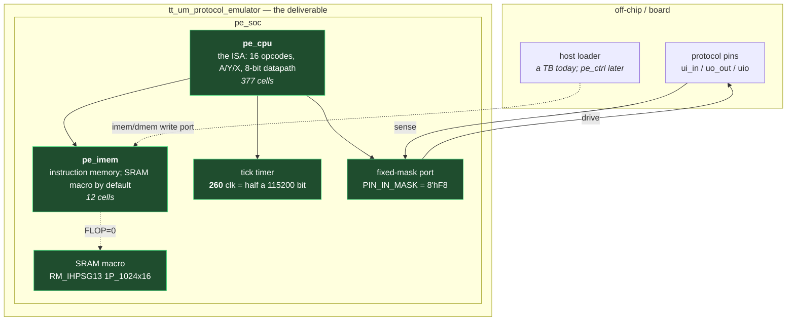
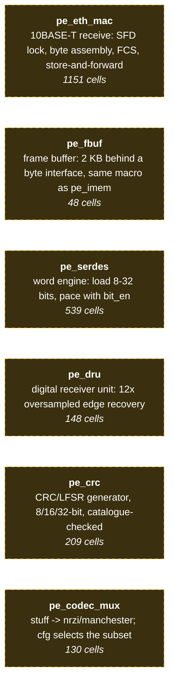

# Block diagram

> **Generated** by `tools/gen/block_diagram.py`. The built/orphan split is
> checked against `rtl/` and `regress/run_all.sh` on every regression, so a block
> cannot be drawn as a signal path unless something instantiates it.

**Rendered copies you can open without a Mermaid viewer:**
`diagrams/block-diagram-chip.svg` (below) and
`diagrams/block-diagram-orphans.svg` (the orphans). They are produced from
the blocks on this page by `tools/gen/render_block_diagram.py`, so the rendering
cannot drift from the source here.

## What is in the chip today

Read this as **two styles coexisting on purpose**. The firmware core
bit-bangs pins; the SERDES is a word engine. [[plans/through-i2c]] argues
why, and the short version is that control flow is per-bit for I2C
(ACK, arbitration, clock stretch) and per-word for UART/SPI/CAN/USB.



### Built, verified — and wired to nothing

These blocks pass their own testbenches but no SoC instance drives them.
Drawn as detached, because that is what they are:



## The built blocks, and where they actually live

| block | role | instantiated in | cells | TB |
|---|---|---|---|---|
| `pe_cpu` | the ISA: 16 opcodes, A/Y/X, 8-bit datapath | pe_soc.v | 377 | `tb_pe_cpu` |
| `pe_imem` | instruction memory; SRAM macro by default | pe_soc.v | 12 | `tb_pe_imem` |
| `pe_pinmux` | per-pin direction, open-drain, read-back (the I2C gate) | pe_soc.v | 111 | `tb_pe_pinmux` |
| `pe_nrzi` | NRZI encode/decode | pe_codec_mux.v | 15 | `tb_pe_codec_mux` |
| `pe_manch` | Manchester encode/decode | pe_codec_mux.v | 7 | `tb_pe_codec_mux` |
| `pe_bitstuff` | bit stuffing (CAN/USB style) | pe_codec_mux.v | 99 | `tb_pe_codec_mux` |
| `pe_eth_mac` | 10BASE-T receive: SFD lock, byte assembly, FCS, store-and-forward | **nowhere — orphan** | 1151 | `tb_pe_eth_mac` |
| `pe_fbuf` | frame buffer: 2 KB behind a byte interface, same macro as pe_imem | **nowhere — orphan** | 48 | `tb_pe_fbuf` |
| `pe_serdes` | word engine: load 8-32 bits, pace with bit_en | **nowhere — orphan** | 539 | `tb_pe_serdes` |
| `pe_dru` | digital receiver unit: 12x oversampled edge recovery | **nowhere — orphan** | 148 | `tb_pe_dru` |
| `pe_crc` | CRC/LFSR generator, 8/16/32-bit, catalogue-checked | **nowhere — orphan** | 209 | `tb_pe_crc` |
| `pe_codec_mux` | stuff -> nrzi/manchester; cfg selects the subset | **nowhere — orphan** | 130 | `tb_pe_codec_mux` |

### Orphans: built, tested, and driving nothing

**6 of 12 blocks are instantiated nowhere in `rtl/`.**
That is not an accident and not a bug in the diagram — it is the project's
staging: each block was built and verified standalone before anything
wired it up. But it is worth stating plainly, because it is the single
biggest gap between "what is built" and "what the chip does":

- **`pe_eth_mac`** — 10BASE-T receive: SFD lock, byte assembly, FCS, store-and-forward
- **`pe_fbuf`** — frame buffer: 2 KB behind a byte interface, same macro as pe_imem
- **`pe_serdes`** — word engine: load 8-32 bits, pace with bit_en
- **`pe_dru`** — digital receiver unit: 12x oversampled edge recovery
- **`pe_crc`** — CRC/LFSR generator, 8/16/32-bit, catalogue-checked
- **`pe_codec_mux`** — stuff -> nrzi/manchester; cfg selects the subset

[[STATUS]] gotcha 14 is the rule this section exists to satisfy:
**"hardware nothing exercises is hardware you have not tested."** A block
with a passing TB is verified *in isolation*; that is weaker than verified
in the design, and the difference is exactly what this table shows.

## Planned, and why each one is a gate

| not built yet | what it unblocks |
|---|---|
| **pe_ctrl (SPI load path)** | boot the chip in real silicon; today the loader is a host port driven by the TB, so the chip cannot boot itself |
| **pe_serdes into the SoC** | the SERDES is routed and TB-proven but no SoC instance drives it |
| **I2C transaction layer** | byte transfer, ACK, 7-bit addressing; the pin-level grammar (START/bit cell/STOP) landed 2026-09-23 -- [[concepts/i2c-on-the-matrix]] |

## The two memory stories

There are two memories in the ADRs and only one in the RTL:

- **Instruction memory — BUILT.** `pe_imem` instantiates the PDK's
  `RM_IHPSG13_1P_1024x16_c2_bm_bist` by default (`FLOP=0`). This is the
  SRAM that carries the design's critical path (`A_CLK` -> `A_DOUT`,
  7.635 ns in context at the slow corner), and it is the reason the SoC
  needed its own STA run at all — see [[reference/sram-budget]].
- **Frame buffer — NOT BUILT.** ADR-003 plans a 2 KB frame buffer for
  10BASE-T (a max Ethernet frame is 1518 bytes, so the 1 KB parts miss by
  494). No RTL exists for it.

The `FLOP=1` path in `pe_imem` synthesises a register array instead of the
macro (60,806 cells vs 12). It exists for tests and area experiments and is
mapped separately by `synth_area.sh`; it is **not** what the SoC uses.

## Refreshing the cell counts

Counts come from `regress/synth_area.sh` (mapped, typ corner). To refresh:

```bash
./regress/synth_area.sh | awk 'NF>=3 && $2 ~ /^[0-9]+$/ {print $1, $2}' \
  > wiki/reference/.block-diagram-cells
python3 tools/gen/block_diagram.py
```

## Related

- [[reference/clock-arithmetic]] — the 60 MHz constants every block derives from.
- [[reference/signal-names]] — the port list, generated from the RTL.
- [[concepts/factored-hardware-blocks]] — why these blocks are factored this way.
- [[concepts/pin-matrix]] — the orphan that gates I2C.
- [[plans/through-i2c]] — the ordered work list.
- [[STATUS]] — what is built and verified, in prose.
